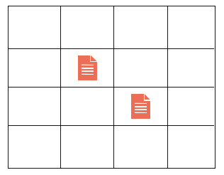
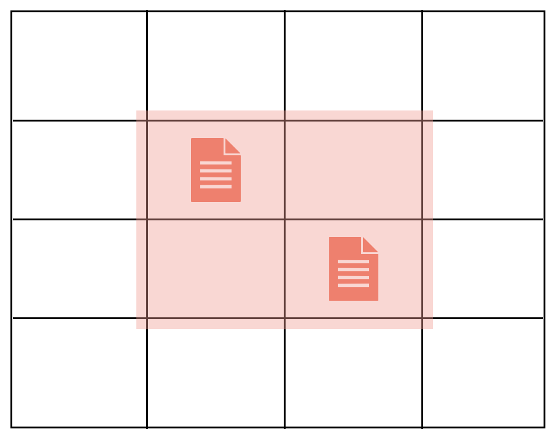
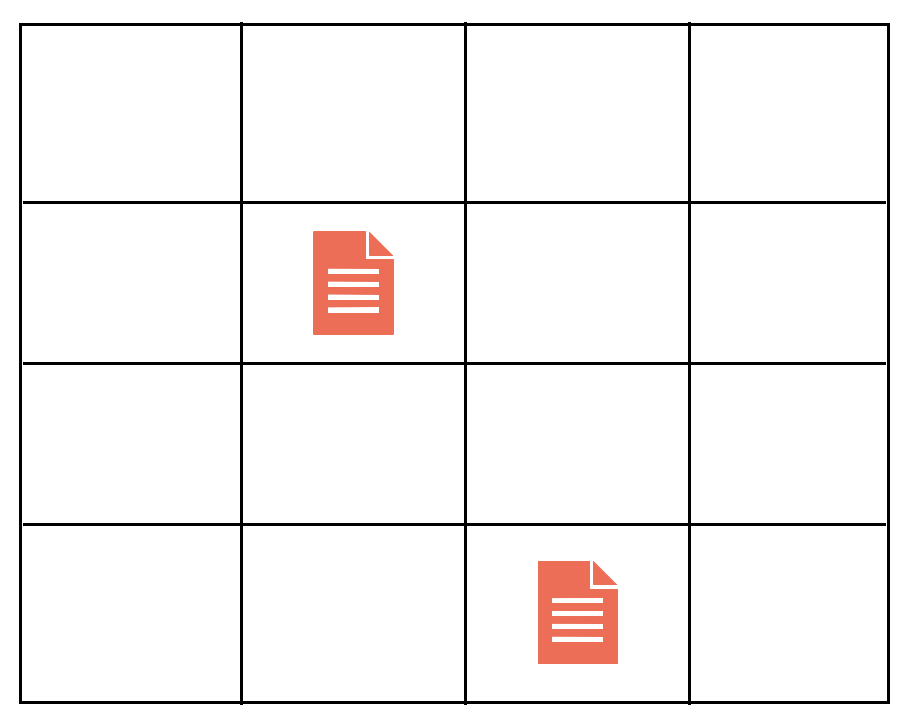
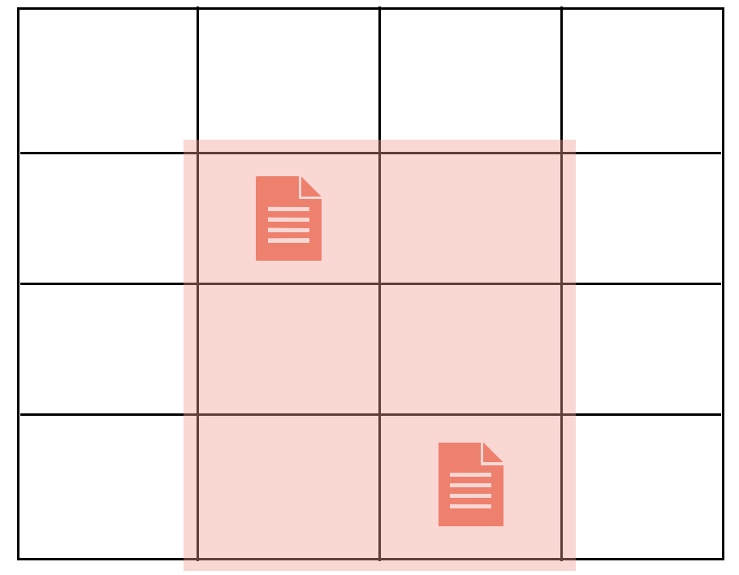

# 바탕화면정리 (프로그래머스)
## 문제
https://school.programmers.co.kr/learn/courses/30/lessons/161990

## 풀이
처음엔 모든 경우의 수 (0, 0, 1, 1), (0, 0, 1, 2) 등 하나씩 계산할려고 했는데 시간 초과도 나고 구현이 쉽지 않음을 느꺘다.
생각을 해보니 좌표가 아니라 파일에 중점을 둬야 겠다는 생각을 했다. 파일을 중점으로 생각하면 파일의 가로 줄, 세로 줄에 따라서 최솟값이 결정됨을 알 수 있다.

다음 상황을 예시로 들어보자.  
  
만약에 파일이 가로 0번줄, 세로 0번줄에 없다면 이 줄은 드래그 하지 않아도 되는 영역이 된다. 마찬가지로 세로 3번줄과 가로 3번줄에도 파일이 없기 때문에
드래그 하지 않아도 된다.

즉 다음과 같은 영역이 형성된다.

이해를 위해 예시 하나를 더 들어보자.  
  

다시 쉽게 말하면, 파일이 있는 줄은 드래그 범위에 들어간다고 보면 된다. 위의 예시는 다음이 정답이 된다.  
  

## 코드
~~~java
import java.util.*;
class Solution {
    static class Point {
        int r, c;
        public Point(int r, int c) {
            this.r = r;
            this.c = c;
        }
    }
    
    public int[] solution(String[] wallpaper) {
        int rLen = wallpaper.length;
        int cLen = wallpaper[0].length();
        
        List<Point> files = new ArrayList<Point>();
        for(int i = 0; i < rLen; i++) {
            for(int j = 0; j < cLen; j++) {
                char c = wallpaper[i].charAt(j);
                if(c == '#') files.add(new Point(i, j));
            }
        }
        
        int lux = Integer.MAX_VALUE;
        int luy = Integer.MAX_VALUE;
        int rdx = Integer.MIN_VALUE; 
        int rdy = Integer.MIN_VALUE;
        for(Point p : files) {
            if(p.r < lux) lux = p.r;
            if(p.c < luy) luy = p.c;
            if(p.r > rdx) rdx = p.r;
            if(p.c > rdy) rdy = p.c;
        }
        
        int[] answer = { lux, luy, rdx + 1, rdy + 1 };
        return answer;
    }
}
~~~

