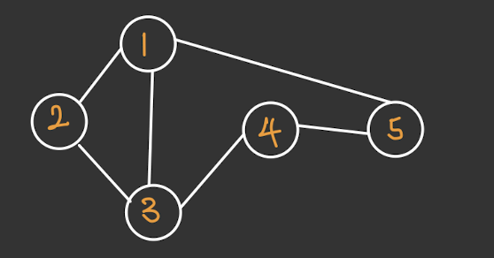
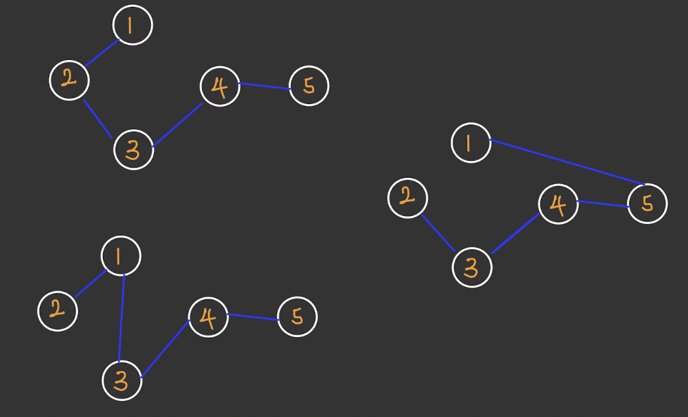
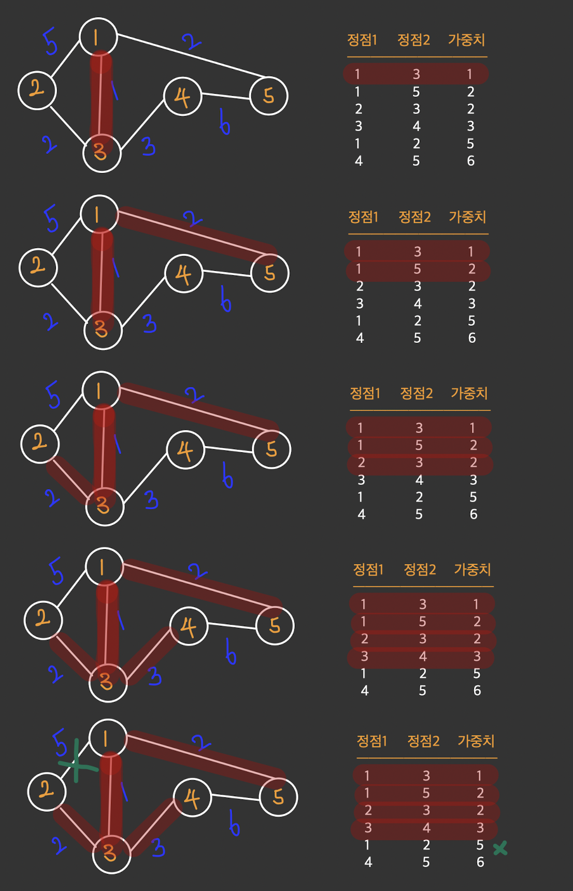
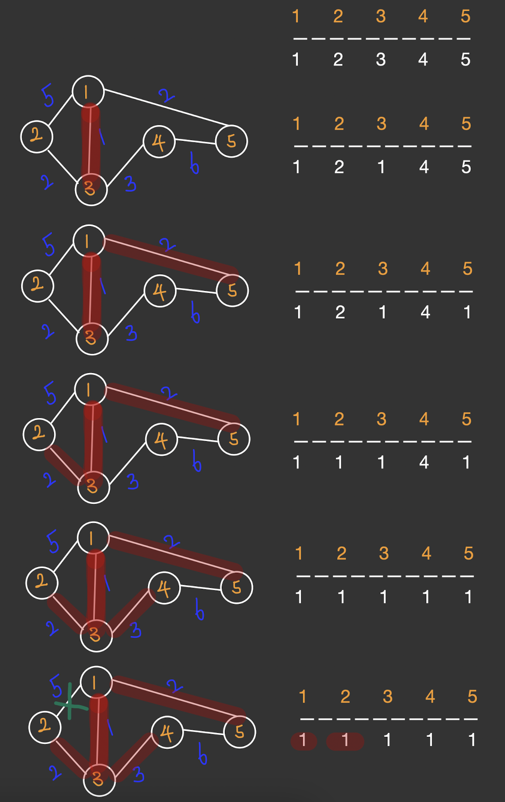
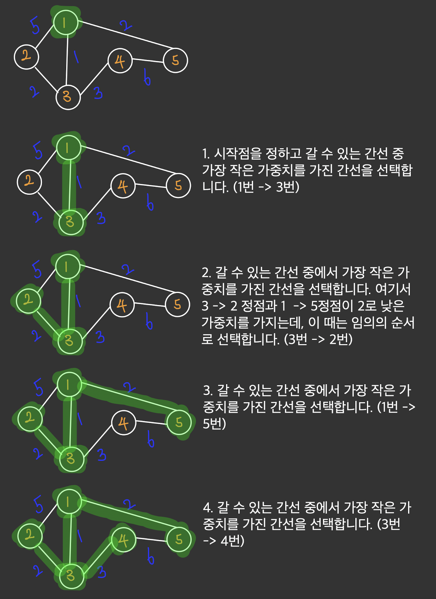

# 최소 스패닝 트리
## 최소 비용 신장트리 (MST, Minimum Spanning Tree)
### 신장트리란?
   신장트리란 그래프의 모든 정점이 연결되어 있고, 싸이클이 포함되지 않은 형태를 말한다. 

  
그래프

  
신장트리 일부

N개의 정점을 가진 그래프는 N-1개의 간선을 갖는 특징을 가지고 있어 통신 네트워크 구축에 많이 사용되고 있다.
예를 들어 N개의 통신 기기를 최소 개수의 링크를 이용하여 구축하는 경우가 있다.

### 최소 비용 신장트리
N-1개의 간선으로 통신 네트워크를 구축하는 방법, 즉 신장트리는 여러가지가 있을 수 있다. 이때, 효율을 높이기 위해서 간선에 가중치를 주고 통신 비용이 낮은 간선들로만 선택해서 
구현하고 싶을 수 있다. 이 때 사용되는 것이 최소 비용 신장트리이다. 최소 비용 신장트리를 구하는 방법에는 2가지가 있다.

#### 1. 크루스칼 알고리즘
   비용이 낮은 간선부터 순환이 생기지 않도록 트리를 연결한다.
  

마지막 단계를 보면 1-2 간선이 그 다음 이어져야 하는데 이때, 1-2를 선택하면 순환이 생겨버린다. 
따라서 이는 연결하지 않는다.

그렇다면 순환을 체크하기 위해 어떻게 해야할까? 
=> union&find를 이용한다.
   
  

#### 2. 프림 알고리즘
프림 알고리즘은 시작 정점을 정하고 갈 f수 있는 간선 중에서 가중치가 가장 낮은 간선을 선택하면서 정점을 방문하는 알고리즘이다.  
  

구현을 할 때는 우선순위 큐를 이용한다.

### 관련 문제
[인프런 9-7](/src/greedy/inflearn/mst/Ch9_7.java)
[최소 스패닝 트리](/src/greedy/baekjoon/mst/Q1197.java)

