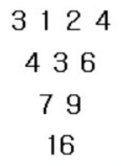
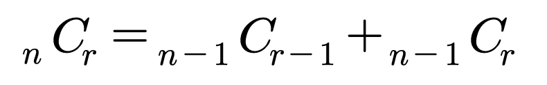

## 수열 추측하기
### 문제
가장 윗줄에 1부터 N까지의 숫자가 한 개씩 적혀 있다. 그리고 둘째 줄부터 차례대로 파스칼의 삼각형처럼 위의 두개를 더한 값이 저장되게 된다.

예를 들어 N이 4 이고 가장 윗 줄에 3 1 2 4 가 있다고 했을 때, 다음과 같은 삼각형이 그려진다. <br>
 <br>

[입력] <br>
첫째 줄에 두개의 정수 N(1≤N≤10)과 F가 주어진다.
N은 가장 윗줄에 있는 숫자의 개수를 의미하며 F는 가장 밑에 줄에 있는 수로 1,000,000 이하이다.

[출력] <br>
첫째 줄에 삼각형에서 가장 위에 들어갈 N개의 숫자를 빈 칸을 사이에 두고 출력한다.
답이 존재하지 않는 경우는 입력으로 주어지지 않는다.

### 풀이
1 ) 규칙 찾기 <br>
3 1 2 4 <br>
4 3 6  => (3 + 1) &nbsp; (1 + 2) &nbsp; (2 + 4) <br>
7 9 &nbsp;&nbsp;&nbsp;=> (3 + 1 + 1 + 2) &nbsp; (1 + 2 + 2 + 4) <br>
16 &nbsp;&nbsp;&nbsp;&nbsp;=> (3 + 1 + 1 + 2 + 1 + 2 + 2 + 4)

조금 정리하면 다음과 같다. 3 + (1 + 1 + 1) + (2 + 2 + 2) + 4 <br>
즉, 이는 3C0 3C1 3C2 3C3과 같다. 

2 ) 조합의 수 구하기 <br>
조합의 수는 다음과 같은 공식으로 구할 수 있다.

 <br>

코드로는 다음과 같이 작성할 수 있다.

```java
public static int DFS(int n, int r) {
    if(mem[n][r] != 0) return mem[n][r];
    if(n == r || r == 0) return 1;
    else {
        return mem[n][r] = DFS(n-1, r-1) + DFS(n-1, r);
    }
}
```
<br>
3 ) 경우의 수 찾기 <br>

```java
for(int i = 1; i <= n; i++) {
    if(ch[i] == 0) {
        ch[i] = 1;
        com[L] = i;
        answer(L + 1);
        ch[i] = 0;
    }
}
```

### 최종
<a href="/src/dfs/inflearn/Ch8_8.java">코드 보기</a>


