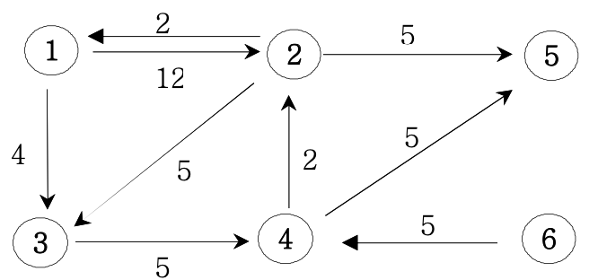

# 다익스트라 알고리즘
### 다익스트라 알고리즘이란?
   다이나믹 프로그래밍을 활용한 최단 경로 탐색 알고리즘으로 음수의 가중치 값이 없다는 것을 전제로 한다.

### 이론

1 ) 1에서 모든 정점으로 가는 최소비용을 구해보자. 먼저 비용을 저장할 dis배열을 준비한 뒤 MAX_VALUE로 초기화 해둔다. 
 ==> dis = { 0, M, M, M, M, M }

2 ) 1을 방문 체크하고 갈 수 있는 정점의 최소 비용을 dis 배열에 입력한다. (최소 비용 =  현재까지의 최소 비용 + 간선의 가중치)  
 ==> dis = { 0, 12, 4, M, M, M }

3 ) dis배열에서 가장 작은 값을 선택한 뒤 1,2를 반복한다.  
 ==> dis = { 0, 12, 4, 9, M, M }

4 ) 만약 최소 비용으로 갈 수 있는 경로가 있으면 이를 업데이트 한다.  
여기서 1 -> 2 경로보다 1 -> 3 -> 4 -> 2가 더 적은 비용이 들기 때문에 이를 11로 업데이트한다.  
 ==> dis = { 0, 11, 4, 9, 14, M }

### 코드
~~~java
while(!pq.isEmpty()) {
    Edge tmp = pq.poll();
    int now = tmp.vex;
    int nowCost = tmp.cost;
    if(nowCost > dis[now]) continue;
    for (Edge edge : graph.get(now)) {
        if(dis[edge.vex] > nowCost + edge.cost) {
            dis[edge.vex] = nowCost + edge.cost;
            pq.offer(new Edge(edge.vex, nowCost + edge.cost));
        }
    }
}
~~~

### 관련 문제
[인프런 9-5](/src/dijkstra/inflearn/Ch9_5.java)