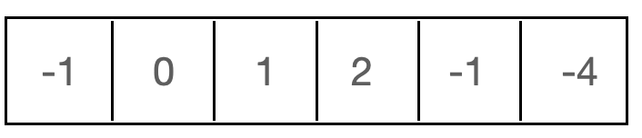
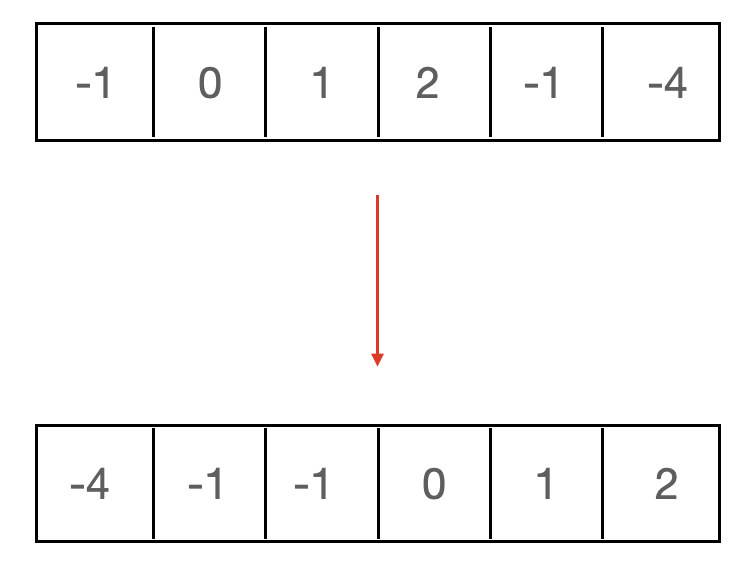

# Three Sum
## Problem
https://leetcode.com/problems/3sum/description

## Solving
### 브루트포스
- for루프를 3번 쓰는 가장 간단한 방법이지만 TLE로 통과하지 못한다.

### 투 포인터 + Set
1. 기본적으로 숫자 a를 하나 선택하면 합이 -a인 두 개의 짝을 찾으면 된다. 

   - -1을 선택하면 두 숫자의 합이 1인 한 쌍을 찾으면 된다. 위의 경우에서는 (0, 1) 순서쌍이 있다.

   - 그런데 단순히 이 방법만 적용하기에는 (-1, 1, 0), (0, -1, 1)과 같은 순서만 다르고 구성은 같은 문제가 생긴다. 이를 해결하기 정렬과 Set을 사용할 수 있다.

      - 정렬된 상태에서 가장 먼저 나온 중복된 숫자만 처리하게 되면 (-1, 1, 0), (0, -1, 1)과 같은 순서만 다르고 구성은 같은 문제를 피할 수 있다.
      - 첫 번째 -1만 처하 두 번째 -1은 처리하지 않는다.
       
 
2. 숫자쌍을 찾을 때는 투 포인터를 사용하면 된다. 
   - 정렬되어 있기 때문에 다음과 같이 작성할 수 있다.
~~~java
for(int i = 0; i < n - 2; i++) {
    int s = i + 1;
    int e = n - 1;
    while(s < e) {
        sum = nums[i] + nums[s] + nums[e];
        if(sum == 0) {
            set.add(List.of(nums[i],nums[s++],nums[e--]));
        }
        else if(sum > 0) e--;
        else s++;
    }
}
~~~

## 전체 코드
~~~java
public class ThreeSum {

    public List<List<Integer>> threeSum(int[] nums) {
        int n = nums.length;
        Arrays.sort(nums);

        Set<List<Integer>> set = new HashSet<>();
        int sum = 0;
        for(int i = 0; i < n - 2; i++) {
            int s = i + 1;
            int e = n - 1;
            while(s < e) {
                sum = nums[i] + nums[s] + nums[e];
                if(sum == 0) {
                    set.add(List.of(nums[i],nums[s++],nums[e--]));
                }
                else if(sum > 0) e--;
                else s++;
            }
        }
        return new ArrayList<>(set);
    }

    public static void main(String[] args) {
        ThreeSum sum = new ThreeSum();
        System.out.println(sum.threeSum(new int[]{-1, 0, 1, 2, -1, -4}));
        sum.threeSum(new int[]{0, 1, 1});
        sum.threeSum(new int[]{0, 0, 0});
    }
}
~~~